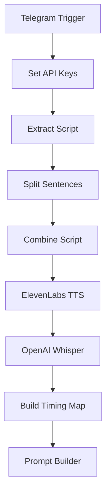

# SWN-OTOM

Automation for generating narrated videos using n8n.

## Workflow Overview

Each node in the workflow includes an in-flow note describing its purpose and any important behaviors, helping future contributors navigate the automation. Related nodes can be further modularized into sub-workflows as the project grows.

